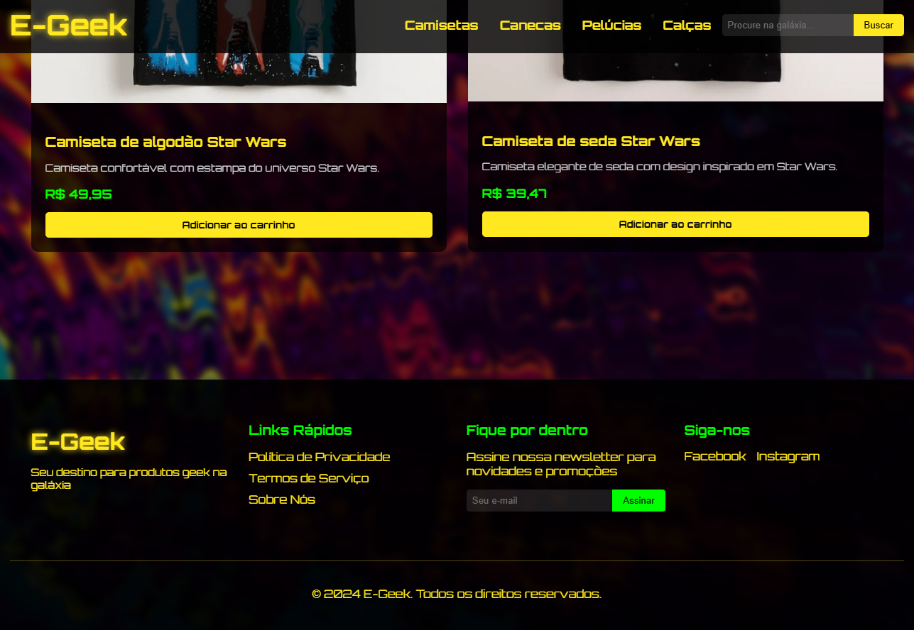
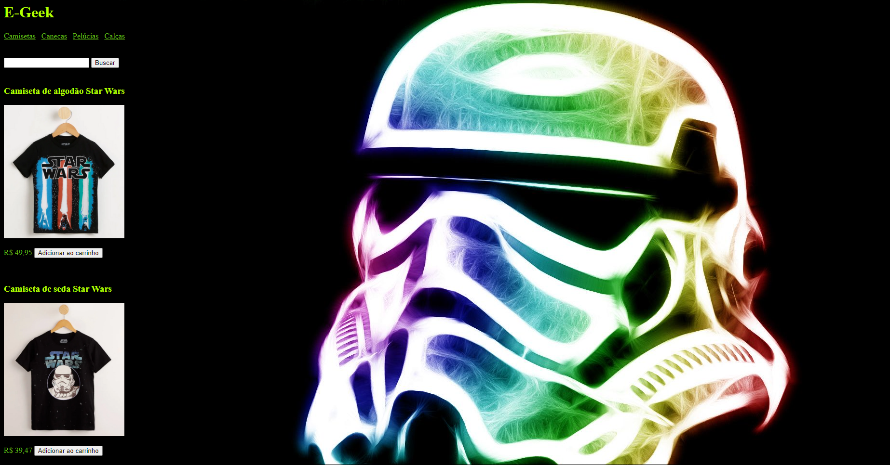

# 🚀 E-Geek: O Império da Cultura Geek
<p align="center">
  <!-- Contador de linguagens do GitHub -->
  
  <!-- Tamanho do repositório no GitHub -->
  
  <!-- Licença do GitHub -->
  
</p>

<div align="center">
  
</div>

## 💻 Sobre o projeto
E-Geek é uma loja online de produtos geek, focada no universo Star Wars. O projeto, originalmente desenvolvido no curso técnico de **Informática para Internet no Senac**, foi atualizado em 2024 com novas funcionalidades e design moderno, destacando habilidades em **HTML5**, **CSS3** e **JavaScript**.

## ⚙️ Funcionalidades
- [x] Design responsivo para desktop e dispositivos móveis
- [x] Footer com links rápidos, newsletter e redes sociais
- [x] Barra de pesquisa para encontrar produtos facilmente
- [x] Navegação intuitiva com menu de categorias
- [x] Exibição de produtos em destaque

## 🛠 Tecnologias
As seguintes tecnologias foram utilizadas na construção do projeto:
- **[JavaScript](https://developer.mozilla.org/en-US/docs/Web/JavaScript)**
- **[HTML5](https://developer.mozilla.org/en-US/docs/Web/HTML)**
- **[CSS3](https://developer.mozilla.org/en-US/docs/Web/CSS)**

## 🧭 Rodando a aplicação
```bash
# Clone este repositório
$ git clone https://github.com/RicardoAndreotti/e-geek.git

# Acesse a pasta do projeto no seu terminal
$ cd e-geek

# Abra o arquivo LojaGeek.html em seu navegador
```

## 🌟 Características Especiais
- Design inspirado no universo Star Wars
- Efeitos visuais para melhorar a interatividade
- Fontes personalizadas para uma experiência autêntica
- Layout adaptável para diferentes tamanhos de tela

## 🎨 Paleta de Cores
A paleta de cores do E-Geek foi cuidadosamente selecionada para evocar a atmosfera do universo Star Wars:
- **Amarelo Star Wars (#FFE81F)**: Cor principal, usada para destaque e elementos importantes.
- **Cinza Imperial (#808080)**: Utilizado para textos secundários e elementos de interface.
- **Verde Sabre de Luz (#00FF00)**: Usado para call-to-actions e elementos interativos.
- **Preto Espacial (#000000)**: Cor de fundo, representando o vasto espaço sideral.

## 📚 Estrutura do Projeto
```
e-geek/
│
├── LojaGeek.html
├── css/
│   └── LojaGeek.css
├── img/
│   ├── Geek01.jpg
│   ├── Camiseta01.PNG
│   └── Camiseta02.PNG
├── html/
│   ├── PoliticaPrivacidade.html
│   ├── TermosServico.html
│   └── SobreNos.html
└── README.md
```

## 🔧 Próximos Passos
- [ ] Implementar funcionalidade de carrinho de compras
- [ ] Adicionar mais categorias de produtos
- [ ] Criar página de detalhes do produto
- [ ] Implementar sistema de avaliações de produtos
- [ ] Adicionar animações sutis para melhorar a experiência do usuário

## 🔄 Versão 1.0
<div align="center">
  
</div>

## 💪 Como Contribuir
Contribuições são bem-vindas! Siga estas etapas para colaborar:
1. Faça um fork do projeto.
2. Crie uma nova branch para sua feature: `git checkout -b feature/nome-feature`.
3. Commit suas mudanças: `git commit -m 'Adiciona nova feature'`.
4. Envie para a branch: `git push origin feature/nome-feature`.
5. Abra um Pull Request.

## 📝 Nota
Este projeto começou como uma atividade técnica e foi aprimorado ao longo do tempo. A versão atual reflete um esforço contínuo para melhorar a funcionalidade e a usabilidade da aplicação.

---

<p align="center">
  Desenvolvido por <a href="https://github.com/RicardoAndreotti">Ricardo Andreotti Gonçalves</a>
</p>
